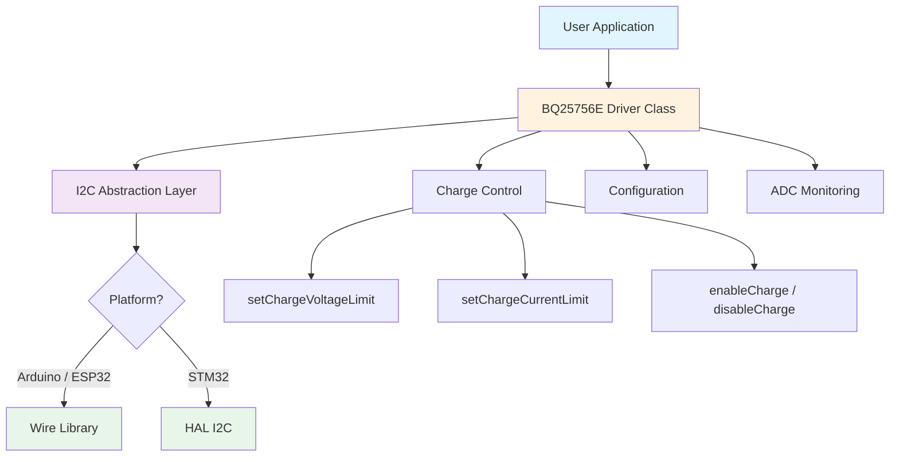

# BQ25756E Multiplatform Library

[](LICENSE.txt)
[](https://github.com/theohg/bq25756e_multiplatform/releases)
[](https://github.com/theohg/bq25756e_multiplatform/actions)


A C++ library for controlling the **[BQ25756E](https://www.ti.com/product/BQ25756E)** buck-boost battery charge controller from Texas Instruments via I2C. Supports Arduino, ESP32, and STM32 platforms with compile-time platform detection.

## Features

- **Multi-platform**: Single codebase for Arduino/ESP32 (Wire) and STM32 (HAL)
- **Charge control**: Configurable voltage, current, pre-charge, and termination limits
- **Safety timers**: Watchdog, top-off, charge safety, and constant-voltage timers
- **ADC monitoring**: Input/battery voltage and current, temperature sensor, feedback voltage
- **MPPT support**: Maximum Power Point Tracking for solar panel applications
- **Fault protection**: Over-voltage, over-current, thermal shutdown detection
- **Reverse mode**: Bidirectional power path with configurable discharge current

## Architecture



```
include/
├── bq25756e.h                 # Driver class, registers, bit masks, config struct
├── bq25756e_platform_config.h # Compile-time platform detection
└── bq25756e_platform_i2c.h    # Platform-agnostic I2C function declarations
src/
├── bq25756e.cpp               # Driver implementation
└── bq25756e_platform_i2c.cpp  # Arduino (Wire) and STM32 (HAL) I2C implementations
```

## Installation

### PlatformIO

Add to your `platformio.ini`:

```ini
lib_deps =
    https://github.com/theohg/bq25756e_multiplatform.git#v1.0.0
```

### Arduino IDE

1. Download or clone this repository
2. Copy into your Arduino `libraries/` folder
3. Restart the Arduino IDE

### STM32 (CubeMX / HAL)

1. Copy `include/` and `src/` into your project
2. The HAL header is auto-detected from your STM32 family define (e.g. `STM32F4xx`). If auto-detection fails, add `-DBQ25756E_STM32_HAL_HEADER='"stm32f4xx_hal.h"'` to your build flags
3. Call `bq25756e_i2c_set_handle(&hi2c1)` once in your initialization code before using the driver

## Quick Start

### Arduino / ESP32

```cpp
#include <Wire.h>
#include <bq25756e.h>

#define BQ25756E_ADDR       0x6A
#define SWITCHING_FREQ      500
#define MAX_CHARGE_CURRENT  5000
#define MAX_INPUT_CURRENT   5000
#define MIN_INPUT_VOLTAGE   4200
#define MAX_INPUT_VOLTAGE   36000

BQ25756E charger(BQ25756E_ADDR, SWITCHING_FREQ,
                 MAX_CHARGE_CURRENT, MAX_INPUT_CURRENT,
                 MIN_INPUT_VOLTAGE, MAX_INPUT_VOLTAGE);

void setup() {
    Serial.begin(115200);
    Wire.begin();

    charger.setDebugStream(&Serial);

    BQ25756E_Config cfg;
    cfg.chargeVoltageLimit      = 1536;  // mV (FB voltage)
    cfg.chargeCurrentLimit      = 2000;  // mA
    cfg.inputCurrentDPMLimit    = 3000;  // mA
    cfg.inputVoltageDPMLimit    = 4200;  // mV
    cfg.prechargeCurrentLimit   = 500;   // mA
    cfg.terminationCurrentLimit = 250;   // mA
    cfg.terminationControlEnabled = true;
    cfg.fastChargeThreshold     = 0b10;  // 66.7% x VFB_REG
    cfg.prechargeControlEnabled = true;
    cfg.chargeEnabled           = true;
    cfg.verbose                 = true;
    charger.init(cfg);
}

void loop() {
    Serial.print("VBAT: ");
    Serial.print(charger.getVBATADC());
    Serial.println(" mV");

    Serial.print("Status: ");
    Serial.println(charger.getChargeCycleStatus());

    delay(2000);
}
```

### STM32

```c
// In main.c, after MX_I2C1_Init():
#include "bq25756e.h"

bq25756e_i2c_set_handle(&hi2c1);  // Required before any BQ25756E operation

BQ25756E charger(0x6A, 500, 5000, 5000, 4200, 36000);
BQ25756E_Config cfg;
cfg.chargeVoltageLimit      = 1536;
cfg.chargeCurrentLimit      = 2000;
cfg.inputCurrentDPMLimit    = 3000;
cfg.inputVoltageDPMLimit    = 4200;
cfg.prechargeCurrentLimit   = 500;
cfg.terminationCurrentLimit = 250;
cfg.terminationControlEnabled = true;
cfg.prechargeControlEnabled = true;
cfg.chargeEnabled           = true;
charger.init(cfg);
```

> See the [`examples/`](examples/) folder for complete, compilable examples.

## API Overview

### Charge Control

| Method | Description |
|--------|-------------|
| `init(cfg)` | Initialize charger with configuration struct |
| `setChargeVoltageLimit(mV)` | Set FB voltage regulation limit |
| `setChargeCurrentLimit(mA)` | Set fast-charge current limit |
| `setInputCurrentLimit(mA)` | Set input current DPM limit |
| `setInputVoltageDPM(mV)` | Set input voltage DPM limit |
| `enableCharge()` / `disableCharge()` | Enable or disable charging |
| `setReverseMode(enable)` | Enable or disable reverse mode |
| `resetRegisters()` | Reset all registers to defaults |

### Configuration

| Method | Description |
|--------|-------------|
| `setPrechargeCurrentLimit(mA)` | Set pre-charge current |
| `setTerminationCurrentLimit(mA)` | Set termination current threshold |
| `configurePrechargeTermination(...)` | Configure pre-charge and termination |
| `configureTopOffTimer(timer)` | Set top-off timer duration |
| `configureWatchdogTimer(timer)` | Set watchdog timer duration |
| `configureChargeSafetyTimer(...)` | Configure charge safety timer |
| `configureADC(...)` | Configure ADC mode, sample speed, averaging |
| `setTSPinFunction(enable)` | Enable/disable TS pin |

### Status & ADC

| Method | Returns |
|--------|---------|
| `getChargeCycleStatus()` | Charge cycle state (0-7) |
| `getChargerStatus1/2/3()` | Status register bytes |
| `getFaultStatus()` | Fault flags (OV, OC, TSHUT, etc.) |
| `getVBATADC()` | Battery voltage [mV] |
| `getVACADC()` | Input voltage [mV] |
| `getIBATADC()` | Battery current [mA] |
| `getIACADC()` | Input current [mA] |
| `getTSADC()` | TS pin reading [% of REGN] |
| `getVFBADC()` | Feedback voltage [mV] |
| `getPartInformation()` | Part number and revision |

### Debug

| Method | Description |
|--------|-------------|
| `setDebugStream(&Serial)` | Set debug output stream (Arduino only) |
| `printChargerConfig()` | Print all register values |

## License

MIT License -- see [LICENSE.txt](LICENSE.txt) for details.

Copyright (c) 2026 Theo Heng
