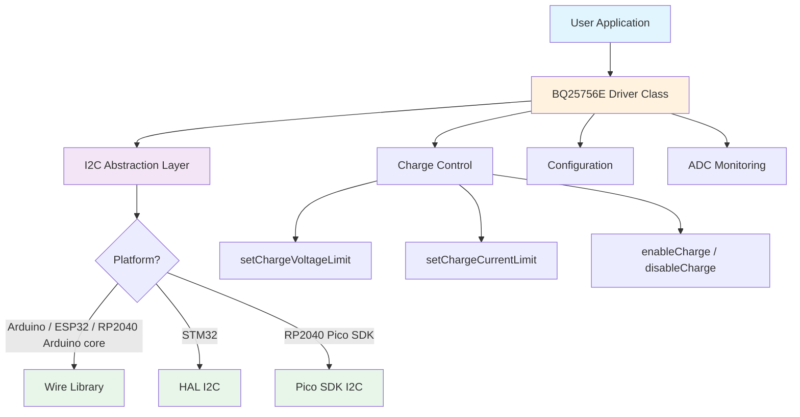

# BQ25756E Multiplatform Library

[](LICENSE.txt)
[](https://github.com/theohg/bq25756e_multiplatform/releases)
[](https://github.com/theohg/bq25756e_multiplatform/actions)


A C++ library for controlling the **[BQ25756E](https://www.ti.com/product/BQ25756E)** buck-boost battery charge controller from Texas Instruments via I2C. It supports Arduino, ESP32, STM32, and RP2040 targets and uses a per-instance bus handle so multiple buses or devices can be used without global transport state.

## Features

- **Multi-platform**: Single codebase for Arduino/ESP32 (Wire), STM32 (HAL), and RP2040
- **Bus-first design**: The active I2C bus is passed directly into the constructor
- **Charge control**: Configurable voltage, current, pre-charge, and termination limits
- **Safety timers**: Watchdog, top-off, charge safety, and constant-voltage timers
- **ADC monitoring**: Input and battery voltage/current, TS pin, and feedback voltage reads
- **MPPT support**: Maximum Power Point Tracking for solar-oriented applications
- **Fault protection**: Over-voltage, over-current, watchdog, and thermal status handling

## Architecture


```mermaid
graph TD
        A[User Application] --> B[BQ25756E Driver Class]
        B --> C[I2C Abstraction Layer]
        C --> D{Platform?}
        D -->|Arduino / ESP32 / RP2040 Arduino core| E[Wire Library]
        D -->|STM32| F[HAL I2C]
        D -->|RP2040 Pico SDK| J[Pico SDK I2C]

        B --> G[Charge Control]
        B --> H[Configuration]
        B --> I[ADC Monitoring]

        G --> G1[setChargeVoltageLimit]
        G --> G2[setChargeCurrentLimit]
        G --> G3[enableCharge / disableCharge]

        style A fill:#e1f5fe
        style B fill:#fff3e0
        style C fill:#f3e5f5
        style E fill:#e8f5e9
        style F fill:#e8f5e9
        style J fill:#e8f5e9
```

## Repository Layout

```text
include/
    bq25756e.h
    bq25756e_platform_config.h
    bq25756e_platform_i2c.h
src/
    bq25756e.cpp
    bq25756e_platform_i2c.cpp
examples/
    basic_charging/
    status_monitoring/
.github/workflows/
    ci.yml
    release.yml
```

## Installation

### PlatformIO

Add to your `platformio.ini`:

```ini
lib_deps =
        https://github.com/theohg/bq25756e_multiplatform.git#v1.1.0
```

### Arduino IDE

Download the repository or a release zip, then add it through Sketch -> Include Library -> Add .ZIP Library.

### STM32 HAL / Pico SDK

Copy `include/` and `src/` into your project, make sure the correct HAL or Pico SDK headers are available to the compiler, and keep I2C initialization in your application code.

## Usage Pattern

1. Initialize the I2C peripheral yourself.
2. Pass the active bus handle as constructor argument 1: `&Wire`, `&hi2c1`, `i2c0`, or `i2c1`.
3. Pass the 7-bit device address as constructor argument 2.
4. Call `init(...)` before using the driver.

For Arduino-based Pico builds, use `&Wire`. For pure Pico SDK builds, use `i2c0` or `i2c1` directly.

## Quick Start

### Arduino / ESP32 / RP2040 Arduino core

```cpp
#include <Wire.h>
#include <bq25756e.h>

#define BQ25756E_ADDR       0x6A
#define SWITCHING_FREQ      500
#define MAX_CHARGE_CURRENT  5000
#define MAX_INPUT_CURRENT   5000
#define MIN_INPUT_VOLTAGE   4200
#define MAX_INPUT_VOLTAGE   36000

BQ25756E charger(&Wire, BQ25756E_ADDR, SWITCHING_FREQ,
                                 MAX_CHARGE_CURRENT, MAX_INPUT_CURRENT,
                                 MIN_INPUT_VOLTAGE, MAX_INPUT_VOLTAGE);

void setup() {
        Serial.begin(115200);
        Wire.begin();

        charger.setDebugStream(&Serial);

        BQ25756E_Config cfg;
        cfg.chargeVoltageLimit        = 1536;
        cfg.chargeCurrentLimit        = 2000;
        cfg.inputCurrentDPMLimit      = 3000;
        cfg.inputVoltageDPMLimit      = 4200;
        cfg.prechargeCurrentLimit     = 500;
        cfg.terminationCurrentLimit   = 250;
        cfg.terminationControlEnabled = true;
        cfg.prechargeControlEnabled   = true;
        cfg.chargeEnabled             = true;
        cfg.verbose                   = true;
        charger.init(cfg);
}

void loop() {
        Serial.print("VBAT: ");
        Serial.println(charger.getVBATADC());

        Serial.print("Status: ");
        Serial.println(charger.getChargeCycleStatus());
        delay(2000);
}
```

### STM32 HAL / Pico SDK

```cpp
#include "bq25756e.h"

BQ25756E charger(&hi2c1, 0x6A, 500, 5000, 5000, 4200, 36000);
// For a pure Pico SDK project, pass i2c0 or i2c1 instead of &hi2c1.

void app_init() {
        BQ25756E_Config cfg;
        cfg.chargeVoltageLimit      = 1536;
        cfg.chargeCurrentLimit      = 2000;
        cfg.inputCurrentDPMLimit    = 3000;
        cfg.inputVoltageDPMLimit    = 4200;
        cfg.prechargeCurrentLimit   = 500;
        cfg.terminationCurrentLimit = 250;
        cfg.chargeEnabled           = true;
        charger.init(cfg);
}
```

## Functional Overview

### Charger Capabilities

| Capability | Description |
|------------|-------------|
| Charge configuration | Set charge voltage, fast-charge current, pre-charge, and termination limits |
| Input management | Configure input current and voltage DPM thresholds |
| Safety features | Control watchdog, top-off, safety timer, and constant-voltage timing |
| Monitoring | Read battery, input, feedback, current, and temperature-related ADC channels |
| Advanced control | Use MPPT and reverse-mode related settings when the application needs them |

## API Overview

### Charge Control

| Method | Description |
|--------|-------------|
| `init(cfg)` | Initialize charger with a configuration struct |
| `setChargeVoltageLimit(mV)` | Set the FB voltage regulation limit |
| `setChargeCurrentLimit(mA)` | Set fast-charge current limit |
| `setInputCurrentLimit(mA)` | Set input current DPM limit |
| `setInputVoltageDPM(mV)` | Set input voltage DPM limit |
| `enableCharge()` / `disableCharge()` | Enable or disable charging |
| `setReverseMode(enable)` | Enable or disable reverse mode |
| `resetRegisters()` | Reset device registers to defaults |

### Configuration

| Method | Description |
|--------|-------------|
| `setPrechargeCurrentLimit(mA)` | Set pre-charge current |
| `setTerminationCurrentLimit(mA)` | Set termination current threshold |
| `configurePrechargeTermination(...)` | Configure pre-charge and termination behavior |
| `configureTopOffTimer(timer)` | Set top-off timer duration |
| `configureWatchdogTimer(timer)` | Set watchdog timer duration |
| `configureChargeSafetyTimer(...)` | Configure charge safety timer |
| `configureADC(...)` | Configure ADC mode, sampling, and averaging |
| `setTSPinFunction(enable)` | Enable or disable TS pin handling |

### Status and ADC

| Method | Returns |
|--------|---------|
| `getChargeCycleStatus()` | Charge cycle state |
| `getChargerStatus1()` / `getChargerStatus2()` / `getChargerStatus3()` | Status register bytes |
| `getFaultStatus()` | Fault flags |
| `getVBATADC()` | Battery voltage [mV] |
| `getVACADC()` | Input voltage [mV] |
| `getIBATADC()` | Battery current [mA] |
| `getIACADC()` | Input current [mA] |
| `getTSADC()` | TS pin reading |
| `getVFBADC()` | Feedback voltage [mV] |
| `getPartInformation()` | Part number and revision |

### Debug

| Method | Description |
|--------|-------------|
| `setDebugStream(&Serial)` | Set debug output stream on Arduino-style targets |
| `printChargerConfig()` | Print register values and configuration |

## Examples

- `examples/basic_charging/basic_charging.ino`
- `examples/status_monitoring/status_monitoring.ino`

## Notes

- Device addresses are always 7-bit.
- For Arduino-based Pico builds, use `&Wire`; for pure Pico SDK builds, pass `i2c0` or `i2c1`.
- `setDebugStream()` is optional and mainly useful on Arduino-style targets.
- PlatformIO CI compiles the examples on Arduino Nano, ESP32, STM32, and RP2040.

## You Like This Library? See Also

- [DRV8214 Multiplatform](https://github.com/theohg/drv8214_multiplatform)
- [INA228 Multiplatform](https://github.com/theohg/ina228_multiplatform)
- [TPS26750 Multiplatform](https://github.com/theohg/tps26750_multiplatform)

## License

MIT License. See [LICENSE.txt](LICENSE.txt) for details.

Copyright (c) 2026 Theo Heng
